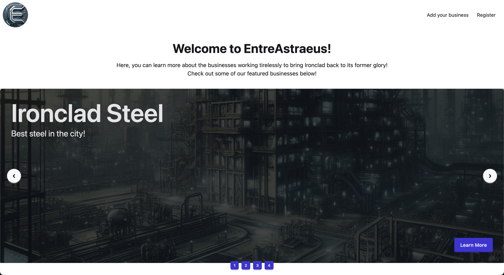
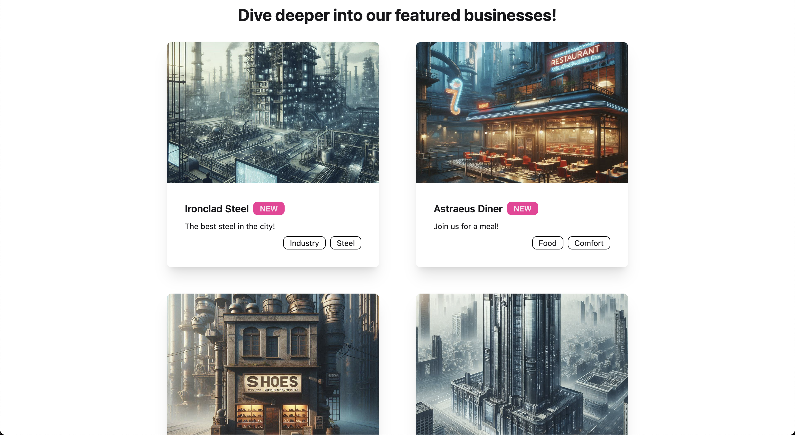
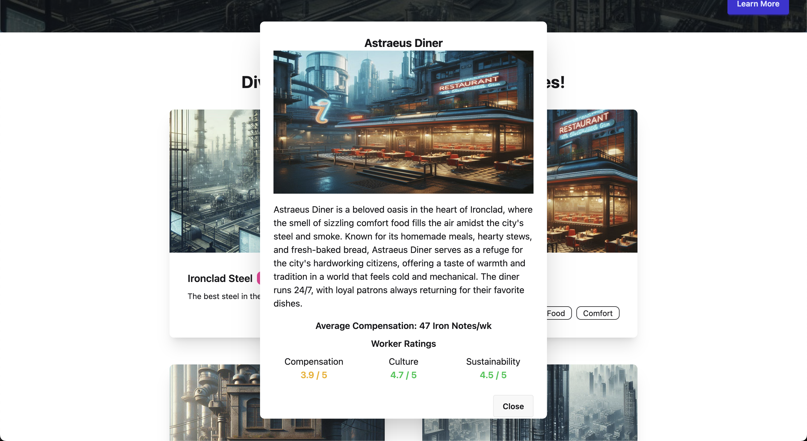
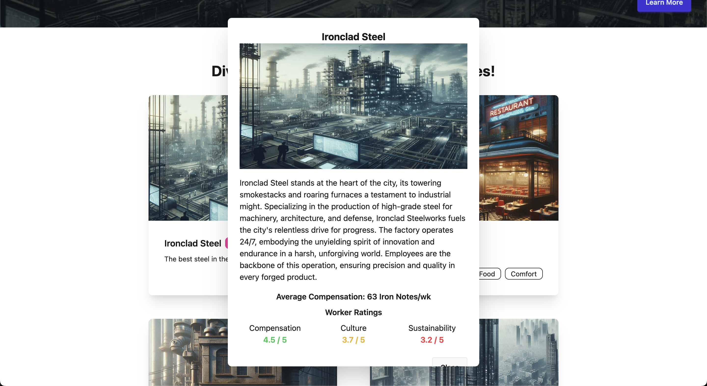
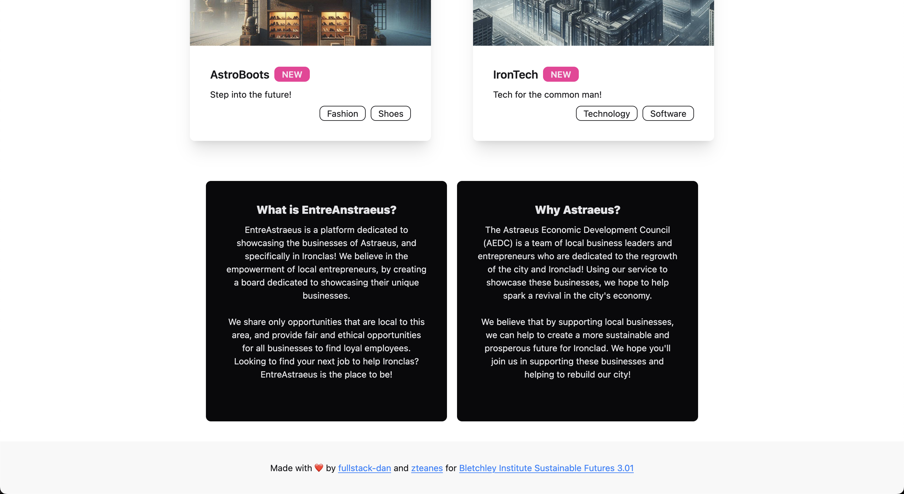

# Business Board: EntreAstraeus

## Description

This project is a design for a board listing site specifically made for companies to showcase
their businesses! Here, they are able to find employees to help them grow their business,
and in turn help grow the economy.

## How to Run

1. Clone the repository
2. Run `npm install`
3. Run `npm run dev`

After this, the project should be running on `localhost:____`.

## Purpose

This was made as apart of the Bletchley Institute's Sustainable Future Waypoint 3! You can find
out more about the competition and Blethley Institute [here](https://www.bletchley.org/contests/sustainable-futures-3-01-paths-to-progress?utm_campaign=Mastery+Quest+Announcement+-+Sustainable+Futures-+wp3+wk1+-+012025&utm_content=Mastery+Quest+-+Sustainable+Futures+-+wp3+wk1+-+01-20-25&utm_medium=email_action&utm_source=customer.io).

## Screenshots

The home page of the site.

The board of businesses.

The page for a specific business.

The page for a specific business.

The footer and about section.

